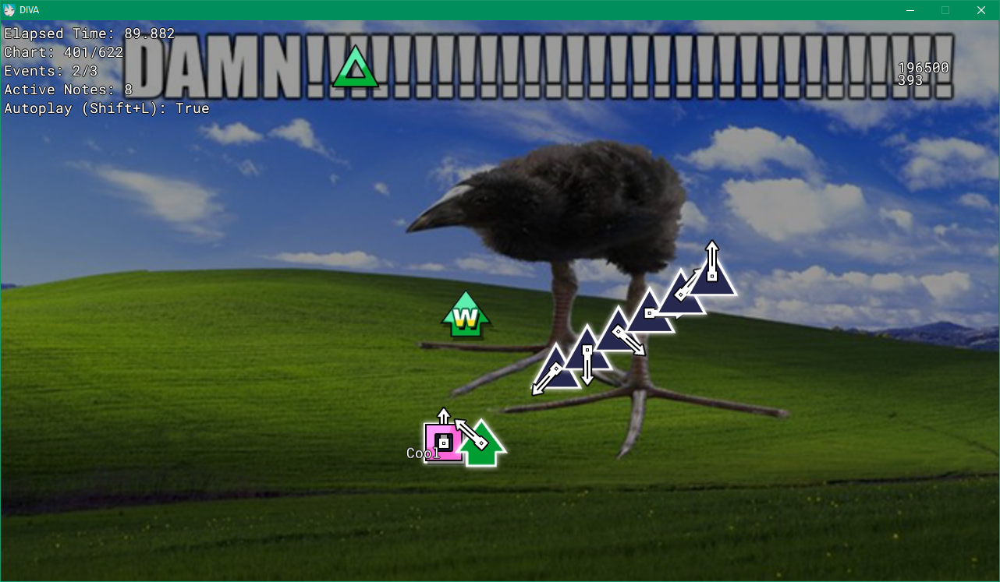

# Even More Cursed DIVA

A Project DIVA ⭐⭐⭐rip-off⭐⭐⭐ written in C++ and using OpenGL 1.4 with ARB extensions ✅✅❌✅❌❌❌✅❌❌❌

### Preamble
Among sus has ruined my life

I can't take it any more. Among Us has singlehandedly ruined my life. The other day my teacher was teaching us Greek Mythology and he mentioned a pegasus and I immediately thought 'Pegasus? more like Mega Sus!!!!' and I've never wanted to die more. I can't look at a vent without breaking down and sobbing in shambles. I can't eat pasta without thinking 'IMPASTA??? THATS PRETTY SUS!!!!' Skit 4 by Kanye West. The lyrics ruined me. A Mongoose, or the 25th island of greece. The scientific name for pig. I CAN'T take it anymore. Please end my suffering.

Having that said, here's some shitty code I'm currently working on. The project itself is actually a custom game engine thing named Starshine and written with compatibility with Windows XP-era integrated GPUs in mind (such as Intel GMA 3150). The "Project DIVA" part of this is actually a test game for said engine (i'm really good with my game ideas). If you're curious about the name, I guess I seem to really like that equilateral concave decagon that most people refer to as "star" (yes, I looked that up on Wikipedia) and I thought that the name "Starshine" sounded really cool, or something along those lines.

Naming really do be hard...

## dear god why
I could probably say something about how this is a valuable learning experience for me, but honestly, even disregarding complaints from diehard C++ fans about others not writing code the same way as they do/C purists that complain about C++ and/or STL making things more complicated than they need to be (tbf this one is kinda true and also applies to this "project"), I'm still surprised that this thing can compile and run mostly the way it's expected to. A lot of this code has been written in C# style since this is the only other language I'm somewhat familiar with, and also various code pieces have been written at heavily different points of time, so don't be surprised to find a non-existing code structure, header files with little useful content inside, instances of mishandling allocated memory, uses of SDL headers instead of standard library and vice versa in different files for no reason, assignments to function arguments instead of class' members which have the same name, botched attempts at optimization and edge case handling which only cause more problems and other glaring issues that would make Yandere Simulator's source code look better in comparison (i can't even name and structure my commits properly, bruh).

Oh yeah, while we're at it, if you think that most of this code looks awfully similar to the code from samyuu's [ComfyStudio](https://github.com/samyuu/Comfy), you're completely right: I have used code from that project as a reference, and by "using it as a reference" I mean stealing half of the code but *changing it up a bit* so it doesn't look completely copy-pasted without a side-by-side comparison. It'll probably come back to bite my ass later, so heavy project rewrite is in the plans (around the date of the Heat Death of the Universe, most likely), I guess. Really, the only major difference between ComfyStudio and this project is the use of SDL2 instead of native OS APIs for things like window management, user input and file I/O. At least... mostly: there are calls to Win32 APIs here and there, but they are `#ifdef`'d, at least.

Initially, I didn't plan on making this repository public, but I didn't want to spend even more time constantly rewriting this project from scratch again instead of simply refactoring it. Letting it just sit here also doesn't seem really good, especially if *somebody* ~~(bro though he was cooking with this one😂😂)~~ would want to hack around with this code, but whatever.

## Project Structure
Right now there's only two notable parts of this project, so this section doesn't have much purpose other than add even more things to the "Stolen from ComfyStudio" list. In any case, as of January 13th, 2026 the project structure is the following:

* `StarshineLib` - Base code used across the entire project
* `game` - **Even More Cursed DIVA** itself + some old engine code written before I figured out how to build static libraries in Visual Studio (and by extension, before the existence of `StarshineLib`)
* `tool_spritepack` - I know the text above reads "two notable parts", but this one is included for completeness sake. An **old** sprite packing tool used for... packing sprites. `StarshineLib` already includes a general-purpose 2D rectangle packing algorithm, so in its current state `tool_spritepack` is deprecated, although I do plan rewriting it as part of the content pipeline for packing sprites ahead of time as opposed to runtime.

## ...That's it
[here's some random funny thing i found](https://www.youtube.com/watch?v=465Etz_rgiM)
