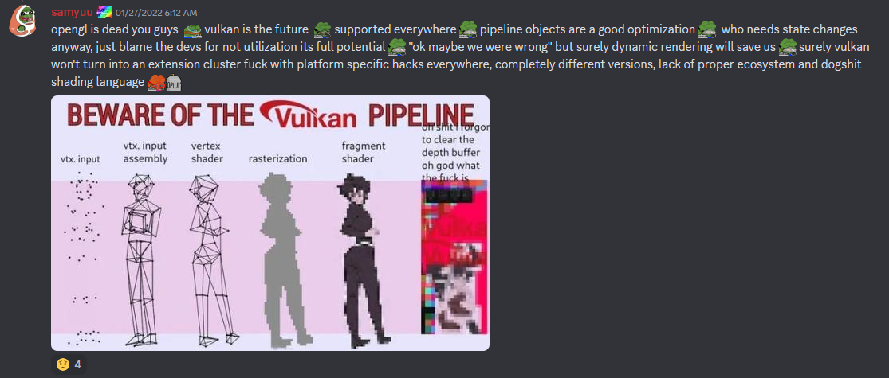
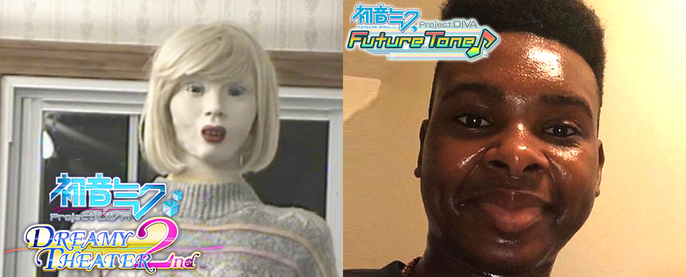

# Even More Cursed DIVA

A Project DIVA ripoff written in C++ and using OpenGL 1.4 with ARB extensions. In reality, more of a sort of game engine thing written with compatibility with Windows XP-era integrated GPUs in mind. Maybe someday it will use something more modern, like OpenGL 4.3 or Direct3D 11.

I probably should point out that this project tries to imitate the gameplay from main console games (PSP/DT games and F series), not Arcade-based ones (Future Tone and Mega Mix). Also, I'm using MinGW 32 toolchain for this thing instead of Microsoft's one, just so I can have (totally unnecessary) Windows XP compatibility and C++17 features (half of which I don't even use. Smart pointers? What are those??😂😂😂😂😂) at the same time.

oops totally unrelated meme

## Why you shouldn't think too much about this thing
I could say something about how this is a valuable learning experience for me, but honestly, even disregarding diehard C++ fans who complain others not writing code the same way as they do, I'm generally surprised that this thing can even compile and run. A lot of this code has been written in C# style since this is another language I'm familiar with the most, and I'm not really familiar with features of modern C++, so don't be surprised to find almsot non-existing code structure, memory leaks, small "utility" functions which generate `std::vector`s, and other glaring issues that would make Yandere Simulator's source code look better in comparison.

Initially, I didn't plan on making this repository public, but I didn't want to spend even more time constantly rewriting this project from scratch over and over again instead of simply refactoring it. Letting it just sit here also doesn't seem really good, especially if *somebody* ~~(bro though he was cooking with this one😂😂)~~ actually wants to hack around with this code, but whatever.

A lot of this code was just me playing around with random ideas and also trying to implement gameplay from some random rhythm game about singing robots with dead eyes/dancing dolls with overly glossy skin (and using random memes from the `Pictures` folder on my PC as placeholders and as part of the "Readme" text doesn't really help the case).

