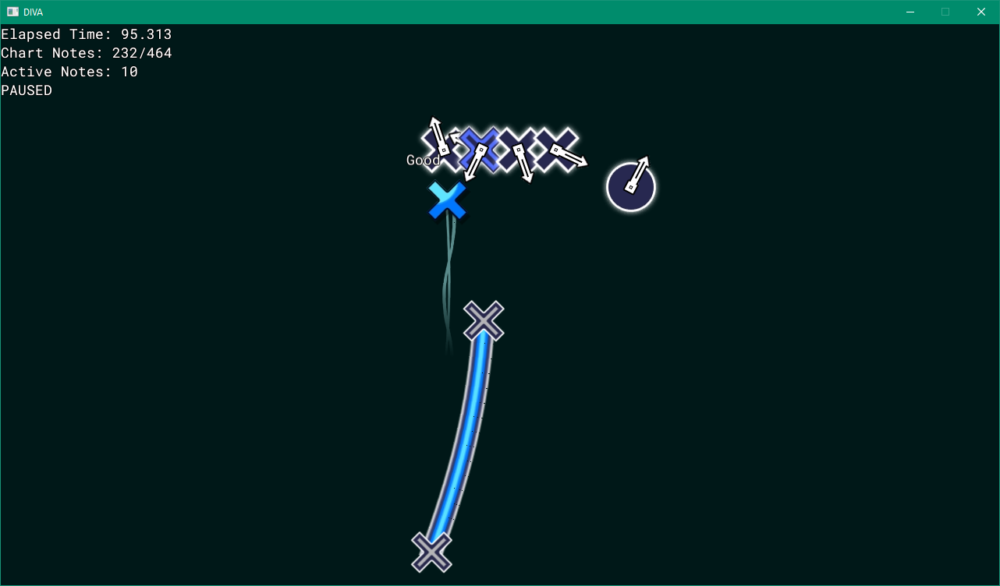

# Even More Cursed DIVA

A Project DIVA ripoff written in C++ and using OpenGL 1.4 with ARB extensions. In reality, more of a sort of game engine thing written with compatibility with Windows XP-era integrated GPUs in mind. Maybe someday it will use something more modern, like OpenGL 4.3 or Direct3D 11.

oops totally unrelated meme
